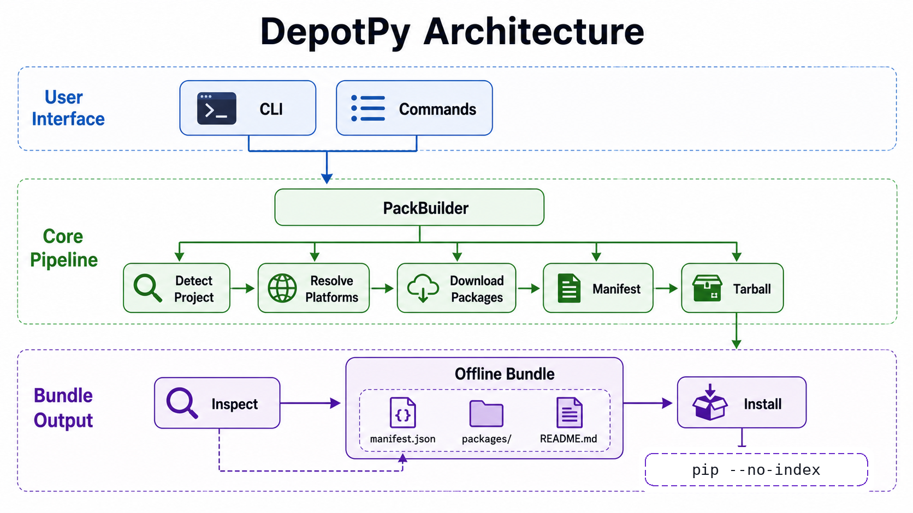

# DepotPy

中文 | [English](https://github.com/MrLYC/depotpy/blob/main/README.md)

为 Python 项目构建可跨平台分发的离线安装包。

DepotPy 分析项目依赖，为多个平台下载 wheels，将所有内容打包为 `.tar.gz` 归档文件，其中包含清单文件和安装说明。生成的离线包可以传输到无网络环境中，通过一条 `pip` 命令即可完成安装。

## 特性

- **跨平台**: 一次性下载 Linux、macOS、Windows 多平台的 wheels
- **自动检测**: 自动识别项目使用的依赖管理工具（uv、poetry、pdm、pipenv、pip）
- **离线可用**: 生成的离线包无需任何网络连接即可安装
- **可验证**: manifest.json 中包含 SHA-256 哈希，用于完整性校验
- **库级 API**: 既可作为 CLI 工具使用，也可作为 Python 库导入

## 安装

```bash
pip install depotpy
```

## 快速开始

```bash
# 为当前平台构建离线包
depotpy pack /path/to/your/project

# 为多个平台构建
depotpy pack /path/to/project --platform manylinux2014_x86_64 --platform macosx_11_0_arm64

# 为所有支持的平台构建
depotpy pack /path/to/project --platform all

# 查看离线包内容
depotpy inspect myapp-1.0.0-offline.tar.gz

# 从离线包安装（在目标机器上执行）
depotpy install myapp-1.0.0-offline.tar.gz
```

## 架构概览



DepotPy 是一个仅依赖 Python 标准库的小型 CLI 流水线：

- `depotpy.cli` 解析 `pack`、`inspect`、`install`，再分发到各命令模块。
- `PackBuilder` 负责编排项目检测、平台解析、依赖下载、清单生成和 tarball 创建。
- 离线包包含 `manifest.json`、`packages/` 和生成的 `README.md`。
- `inspect` 从已有离线包读取 `manifest.json`，`install` 解压离线包并执行 `pip install --no-index --find-links ./packages`。

## 文档

| 中文 | English |
|------|---------|
| [快速上手](https://github.com/MrLYC/depotpy/blob/main/docs/zh/getting-started.md) | [Getting Started](https://github.com/MrLYC/depotpy/blob/main/docs/en/getting-started.md) |
| [CLI 参考](https://github.com/MrLYC/depotpy/blob/main/docs/zh/cli-reference.md) | [CLI Reference](https://github.com/MrLYC/depotpy/blob/main/docs/en/cli-reference.md) |
| [Python API 参考](https://github.com/MrLYC/depotpy/blob/main/docs/zh/api-reference.md) | [Python API Reference](https://github.com/MrLYC/depotpy/blob/main/docs/en/api-reference.md) |
| [架构设计](https://github.com/MrLYC/depotpy/blob/main/docs/zh/architecture.md) | [Architecture](https://github.com/MrLYC/depotpy/blob/main/docs/en/architecture.md) |
| [贡献指南](https://github.com/MrLYC/depotpy/blob/main/docs/zh/contributing.md) | [Contributing](https://github.com/MrLYC/depotpy/blob/main/docs/en/contributing.md) |

## 许可证

MIT
